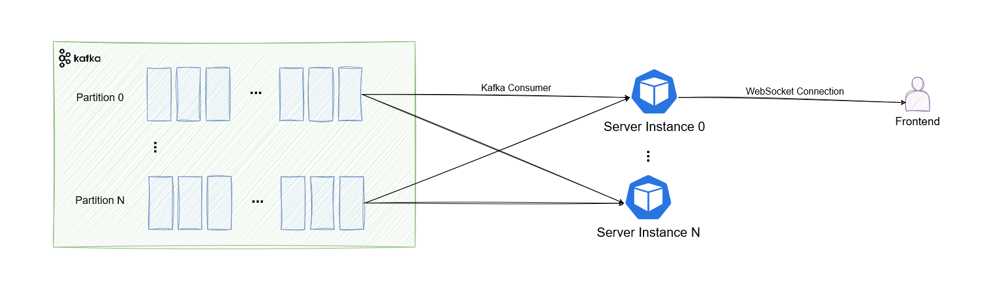

# Kafka WebSocket Broadcaster

This repository contains a simple implementation of a *broadcaster*, a WebSocket server and Kafka consumer that
broadcasts all messages received from a configured Kafka topic to all active WebSocket clients.

## Architecture

The architecture for how this server might be used to expose real-time (Kafka) data to frontend applications
can be seen in the diagram below:

The basic principle is that the *broadcaster* acts as both a websocket server and a Kafka consumer and that messages are
simply broadcast to connected clients.
The clients can optionally, when establishing the connection, use queries in the path to only "subscribe" to
a subset of the data stream (with filtering being done on the server side).  

Due to this server only making sense if the established client receives all messages, and the fact that a single
client (e.g., web application) can only ever be connected to a single server instance,
the underlying Kafka consumer doesn't use consumer group logic, but simply reads and forwards messages
received in "real-time". Due to the current lack of support for this in the library that's used for
interacting with Kafka, this group-less approach is "mimicked" by creating a random consumer group name
and purposely turning off auto commit. With this approach, the consumer group name will never reach the actual
broker (so that we don't unnecessarily create a bunch of unneeded consumer groups).

## End-to-end example

In the [examples](examples) folder, you can find an example of a [simple, static html](examples/html) website that
renders a table and updates it in real-time as new data is coming in.
